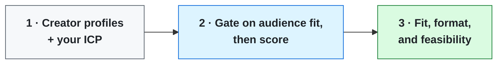

# Creator Partnership Scorer

**Score creators on whether their audience is your audience.**

Creator selection usually runs on three numbers: followers, engagement rate, cost per post. They're not useless — they're dramatically insufficient. They measure surface performance without asking whether this creator's audience is the audience you need, and whether they can deliver a message that moves them.

A creator with 200,000 followers and 6% engagement can generate nothing, because the engaged audience isn't the buyer.

---

## Run it

1. Put `SKILL.md` in your AI tool's instructions field — Claude Project, Custom GPT, Gemini Gem, or an API system prompt.
2. Put anything in `reference/` into its knowledge base or file uploads.
3. Give it creator profiles, audience data where you have it, and a specific ICP.

---

## What it takes

| | |
|---|---|
| **In** | Creator profiles, audience data where you have it, and a specific ICP |
| **Out** | A fit score with all four components, an activation recommendation, and feasibility kept separate |

Missing a required input, it asks instead of guessing.

---

## How it works

1. Gates on audience-to-ICP fit first — a creator failing that isn't scored further
2. Scores whether they can carry *your* message, which is different from whether they're good
3. Reads audience trust from whether people act on their recommendations or just watch
4. Matches each creator to an activation format rather than returning yes or no

## Notes

The useful case is the creator who's the best communicator in the set and fails the gate because their audience is students. A follower-and-engagement process picks them immediately.

The answer isn't just no. License their format for your own paid distribution — buy the craft, not the audience.

---

## Files

| File | What it is |
|---|---|
| `SKILL.md` | The skill. Paste this in |
| `reference/scoring-dimensions.md` | Reference data the skill loads alongside it |

---

## Related

`empirical-audience-persona-builder` → sharpens the ICP

---

MIT © Raneq Barber 
